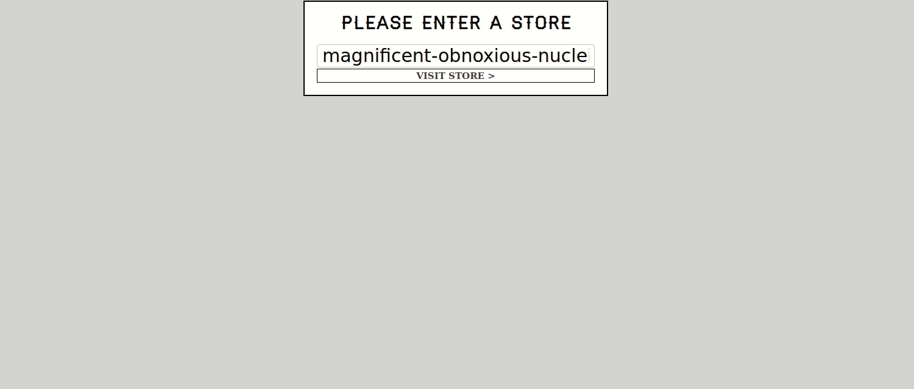

# [React For Beginners](https://ReactForBeginners.com)
I made my first steps in React with Wes Bos course. Check <a href="https://ReactForBeginners.com/">Learn React</a> to do the same.

# What we built

We built a fish store for which we can manage products, prices, inventory and orders. The order is stored locally and the inventory is stored in Firebase.

